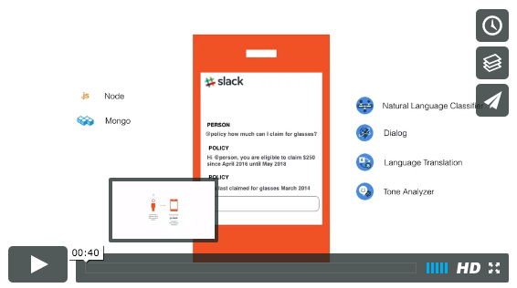

# Cloud Insurance Co. - Main web site and chat bot

| **master** | [](https://travis-ci.org/IBM-Bluemix/insurance-bot) |
| ----- | ----- |
| **dev** | [](https://travis-ci.org/IBM-Bluemix/insurance-bot) |

This repository is part of the larger [Cloud Insurance Co.](https://github.com/IBM-Bluemix/cloudco-insurance) project.

# Overview

[](https://vimeo.com/165460548 "Policy Bot Concept - Click to Watch!")

In order to deploy the full set of microservices involved, check out the [insurance-toolchain repo][toolchain_url]. Otherwise, you can deploy just the app by following the steps here.

## Running the app on Bluemix

1. If you do not already have a Bluemix account, [sign up here][bluemix_reg_url]

1. Download and install the [Cloud Foundry CLI][cloud_foundry_url] tool

1. The app depends on the [Catalog](https://github.com/IBM-Bluemix/insurance-catalog) and [Orders](https://github.com/IBM-Bluemix/insurance-orders) microservices. Make sure to deploy them first.

1. Clone the app to your local environment from your terminal using the following command:

  ```
  git clone https://github.com/IBM-Bluemix/insurance-bot.git
  ```

1. `cd` into this newly created directory

1. Open the `manifest.yml` file and change the `host` value to something unique.

  The host you choose will determinate the subdomain of your application's URL:  `<host>.mybluemix.net`

1. Connect to Bluemix in the command line tool and follow the prompts to log in

  ```
  cf login -a https://api.ng.bluemix.net
  ```

1. Create a Cloudant service in Bluemix

  ```
  cf create-service cloudantNoSQLDB Lite insurance-bot-db
  ```

1. Create a Conversation service in Bluemix

  ```
  cf create-service conversation standard insurance-bot-conversation
  ```

1. Push the app to Bluemix

  ```
  cf push --no-start
  ```

1. Define a variable pointing to the Catalog API deployment.

  ```
  cf set-env insurance-bot CATALOG_URL https://your-insurance-catalog.mybluemix.net
  ```

1. Define a variable pointing to the Orders API deployment.

  ```
  cf set-env insurance-bot ORDERS_URL https://your-insurance-orders.mybluemix.net
  ```

1. Start your app

  ```
  cf start insurance-bot
  ```

And voila! You now have your very own instance of the app running on Bluemix.

## Run the app locally

1. If you do not already have a Bluemix account, [sign up here][bluemix_reg_url]

1. If you have not already, [download Node.js][download_node_url] and install it on your local machine.

1. The app depends on the [Catalog](https://github.com/IBM-Bluemix/insurance-catalog) and [Orders](https://github.com/IBM-Bluemix/insurance-orders) microservices. Make sure to have them running first.

1. Create a Cloudant service in Bluemix

  ```
  cf create-service cloudantNoSQLDB Lite insurance-bot-db
  ```

1. Create a Conversation service in Bluemix

  ```
  cf create-service conversation standard insurance-bot-conversation
  ```

1. In the checkout directory, copy the file ```vcap-local.template.json``` to ```vcap-local.json```. Edit ```vcap-local.json``` and update the credentials for the Cloudant and Conversation services. You can retrieve the service credentials from the Bluemix console.

  ```
  cp vcap-local.template.json vcap-local.json
  ```

1. In the checkout directory, copy the file ```.template.env``` to ```.env```. Edit ```.env``` and update the credentials for the Cloudant and Conversation services. Refer to [this step](#importWorkspace) to get a workspace id.

  ```
  cp .template.env .env
  ```

1. Run

  ```
  npm install
  ```

1. Run

  ```
  npm start
  ```

## Contribute

If you find a bug, please report it via the [Issues section][issues_url] or even better, fork the project and submit a pull request with your fix! We are more than happy to accept external contributions to this project if they address something noted in an existing issue.  In order to be considered, pull requests must pass the initial [Travis CI][travis_url] build and/or add substantial value to the sample application.

## Troubleshooting

The primary source of debugging information for your Bluemix app is the logs. To see them, run the following command using the Cloud Foundry CLI:

  ```
  $ cf logs insurance-bot --recent
  ```

For more detailed information on troubleshooting your application, see the [Troubleshooting section](https://www.ng.bluemix.net/docs/troubleshoot/tr.html) in the Bluemix documentation.

## License

See [License.txt](License.txt) for license information.

# Privacy Notice

This application is configured to track deployments to [IBM Bluemix](http://www.ibm.com/cloud-computing/bluemix/) and other Cloud Foundry platforms. The following information is sent to a [Deployment Tracker](https://github.com/IBM-Bluemix/cf-deployment-tracker-service) service on each deployment:

* Node.js package version
* Node.js repository URL
* Application Name (`application_name`)
* Space ID (`space_id`)
* Application Version (`application_version`)
* Application URIs (`application_uris`)
* Labels of bound services
* Number of instances for each bound service and associated plan information

This data is collected from the `package.json` file in the application and the `VCAP_APPLICATION` and `VCAP_SERVICES` environment variables in IBM Bluemix and other Cloud Foundry platforms. This data is used by IBM to track metrics around deployments of sample applications to IBM Bluemix to measure the usefulness of our examples, so that we can continuously improve the content we offer to you. Only deployments of sample applications that include code to ping the Deployment Tracker service will be tracked.

## Disabling Deployment Tracking

Deployment tracking can be disabled by removing `require("cf-deployment-tracker-client").track();` from the beginning of the `app.js` file.

[toolchain_url]: https://github.com/IBM-Bluemix/insurance-toolchain
[bluemix_reg_url]: http://ibm.biz/insurance-store-registration
[cloud_foundry_url]: https://github.com/cloudfoundry/cli
[download_node_url]: https://nodejs.org/download/
[issues_url]: https://github.com/ibm-bluemix/insurance-bot/issues
[travis_url]: https://travis-ci.org/
